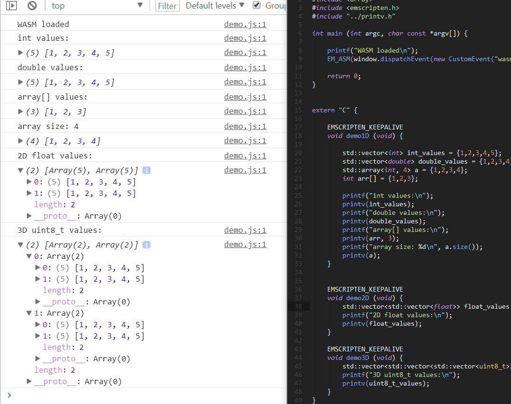

# printv
printf for C++ vectors, for WebAssembly browser use. Useful for debugging.


# To use
```#include``` the ```printv.h``` file in your C++ code after your emscripten import.

To log out data, pass a one, two, or three dimensional vector to ```printv``` function. If using 1D data, you can also use arrays.




# To run the demo
Run ```node server.js``` and navigate to ```localhost:1337```.

# To develop
Install emscripten and run ```node runner.js```.

